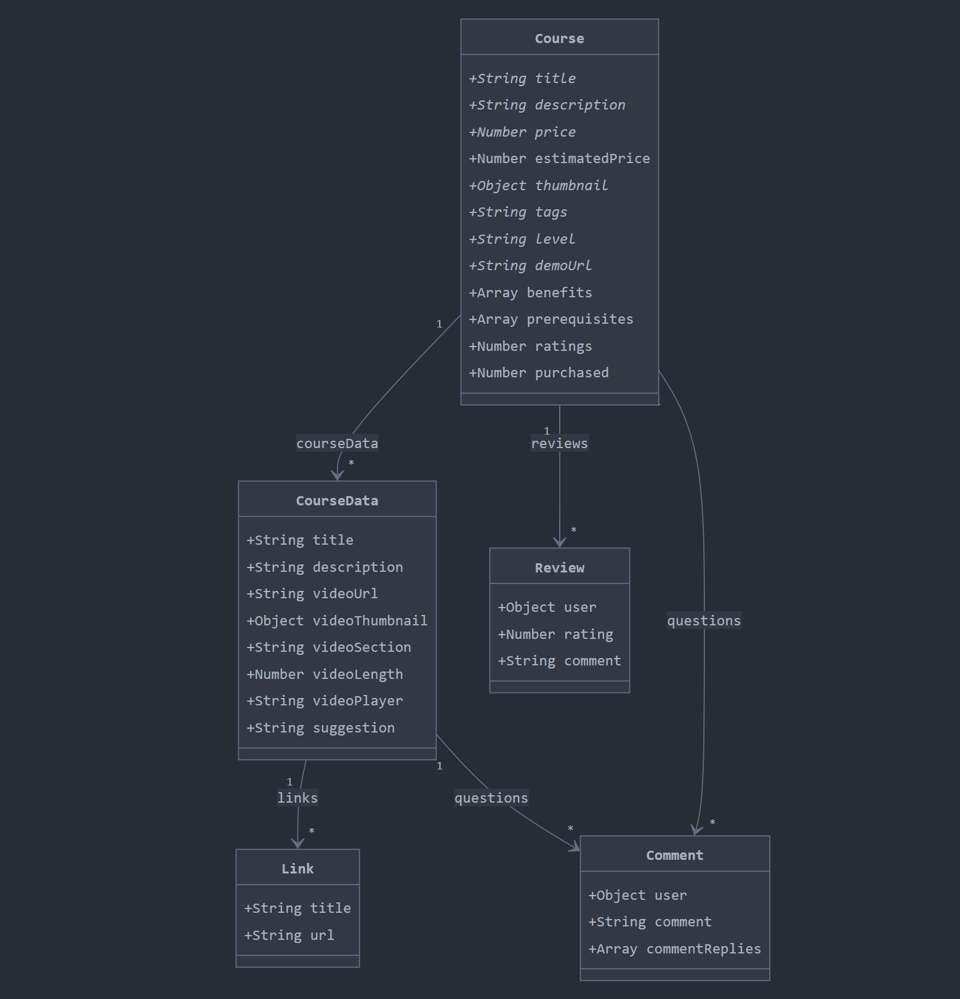

## Dependencies

- bcryptjs
- cookie-parser
- cors
- dotenv
- express
- ioredis
- jsonwebtoken
- mongoose
- ts-node-dev
- @types/bcryptjs
- @types/cookie-parser
- @types/cors
- @types/express
- @types/jsonwebtoken
- @types/node
- typescript
- ejs
- nodemailer
- cloudinary
- npm i node-cron
- npm i @types/node-cron
- npm i --save-dev @types/ejs
- npm i --save-dev @types/nodemailer
- npx tsc --init

## CLOUD

- Upstash - redis
- Cloudinary
- MongoDB

## Course Model

### Core Components

- Course: Main entity with required fields like title, price, and thumbnail
- CourseData: Represents individual lessons/sections with video details
- Review: Student feedback and ratings
- Comment: Discussion/Q&A functionality
- Link: Additional resources/references

### Key Relationships

- One Course can have multiple CourseData (lessons)
- Each Course can receive multiple Reviews
- CourseData can have multiple Links and Comments
- Reviews can have Comment replies

### Notable Fields

- Course tracks purchased count and average ratings
- CourseData includes video metadata (length, URL, thumbnail)
- Comments support nested replies
- Reviews include both ratings and text feedback
